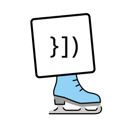
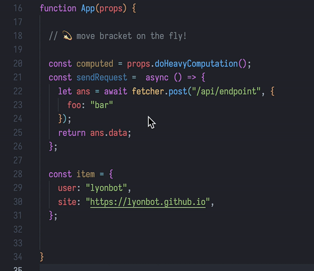
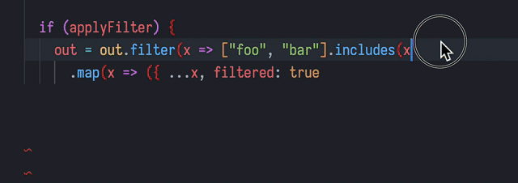

# fix-brackets

  

⚔️ The VS Code extension that helps you fight against brackets!

## Features

- **💫 Magical Closing Brackets 💫**

  - auto enter that mode when typing `]` `)` `}` - can be disabled in settings
  - move them with `Cmd+Arrow`
  - _bonus:_ use `Cmd+G` to toggle that mode on any closing bracket

  

- **🔥 Complete Brackets 🔥**

  - **at end of line**, use `Cmd+Right` to complete brackets
  - works on new lines too

  

## Extension Settings

## Known Issues

- The bracket matching algorithm is not perfect, so it might not work in some cases (eg. some JSX and HTML case)

- The completing algorithm is based on **indent**, I hope you have a decent code formatting.

- The parser is language-irrelative, so it doesn't complete `,` or `;` for you.

## Release Notes

### 0.1.0

Initial release of fix-brackets

- **💫 Magical Closing Brackets 💫**

  - auto enter that mode when typing `]` `)` `}` - can be disabled in settings
  - move them with `Cmd+Arrow`
  - use `Cmd+G` to toggle that mode on any closing bracket

- **🔥 Complete Brackets 🔥**

  - **at end of line**, use `Cmd+Right` to complete brackets
  - different behavior on empty / non-empty lines
