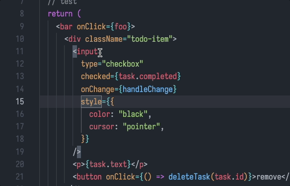

# F Brackets

⚔️ Fight against Brackets. Fly brackets.

[💾 Install on VSCode](https://marketplace.visualstudio.com/items?itemName=lyonbot.fix-brackets) - [💬 Feedback](https://github.com/lyonbot/fix-brackets/issues)

## Features

- **💫 Magical Brackets: move on the fly 💫**

  When a glowing box wraps a bracket, you can **quickly move** brackets with:

  - `Cmd+▲` `Cmd+▼` move by line
  - `Cmd+◀` `Cmd+▶` by token
  - `Cmd+Alt+◀` `Cmd+Alt+▶` by character

  Brackets are wrapped while typing, or use `Cmd+G` to toggle magical mode.

  

- **💥 Split Lines / HTML Attrs 💥**

  Put caret on the bracket (or HTML tag name), then toggle line breaks with `💡code actions` ( shortcut: `Cmd+.` then press `B` to quickly find it )

  

- **🔥 Complete Brackets 🔥**

  - **at end of line**, use `Cmd+▶` to complete brackets
  - works on new lines too

  

## Extension Settings

## Known Issues

- The bracket matching algorithm is not perfect, so it might not work in some cases (eg. some JSX and HTML case)

- The completing algorithm is based on **indent**, I hope you have a decent code formatting.

- The parser is language-irrelative, so it doesn't complete `,` or `;` for you.

## Release Notes

### 0.1.0

Initial release of fix-brackets

- **💫 Magical Closing Brackets 💫**

  - auto enter that mode when typing `]` `)` `}` - can be disabled in settings
  - move them with `Cmd+Arrow`
  - use `Cmd+G` to toggle that mode on any closing bracket

- **🔥 Complete Brackets 🔥**

  - **at end of line**, use `Cmd+▶` to complete brackets
  - different behavior on empty / non-empty lines

### 0.2.2

Improve algorithm about bracket matching

- Support grouping `<tag />`
- Support fuzzing match for malformed bracket pairs
- Improve behaviors on line breaks.

### 0.2.3

Extended scan range, including brackets in comments and string literals

- Move brackets in string and comment
- Complete block comments' `*/` with `Cmd+▶`
- Complete brackets in string
- Use `Alt+◀` and `Alt+▶` to move by one character. (in case things goes weird)

### 0.2.5

Improve default settings

- Use `Cmd+Alt+◀` and `Cmd+Alt+▶` to move by character, cause I find `Alt+▶` is more meaningful for moving caret.

### 0.2.6

Feature: split lines 🚀 put caret on a bracket or its nearby spaces, then use `Cmd+.` to split / join lines of its content.

### 0.2.7

Feature: split HTML attributes 🚀 put caret on a HTML tag name, then use `Cmd+.` to split / join attributes to lines.
